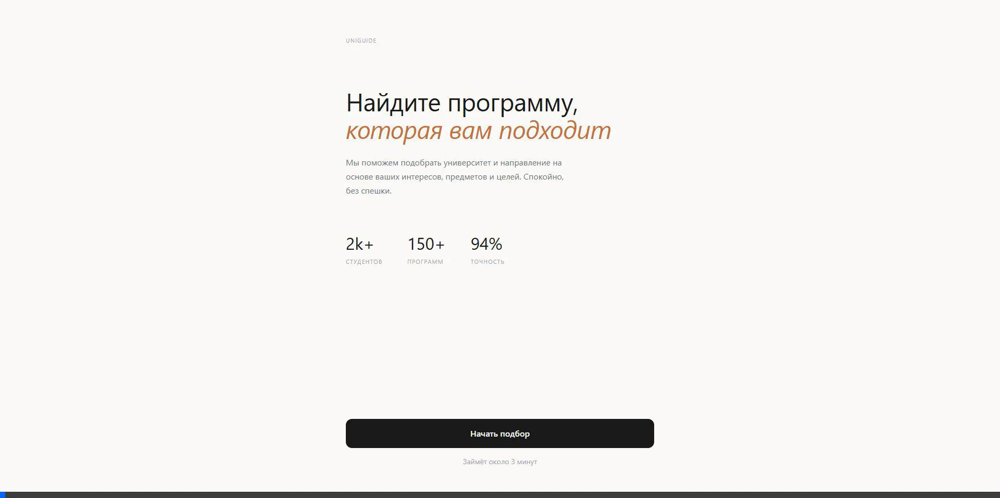
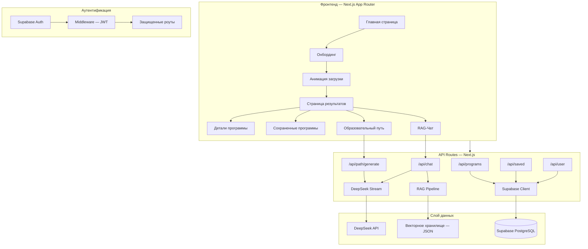
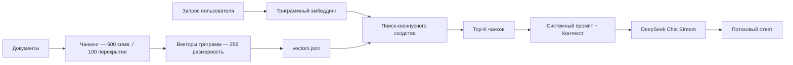
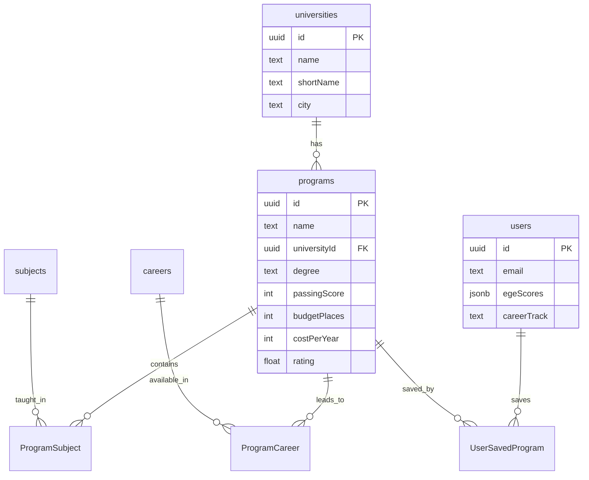

<p align="center">
  <strong>UNIGUIDE</strong><br/>
  <sub>Умная платформа для подбора образовательных программ с AI</sub>
</p>

<p align="center">
  
  
  
  
  
  
</p>

<p align="center">
  
</p>


## О проекте

**UNIGUIDE** — это полнофункциональное веб-приложение, которое помогает абитуриентам найти лучшую образовательную программу в вузах России на основе баллов ЕГЭ, карьерных целей и личных предпочтений. Платформа объединяет структурированные данные из реляционной базы данных с **RAG-чатботом на базе ИИ** и **построением интерактивной образовательной траектории**.

### Ключевые возможности

| Функция | Описание |
|---|---|
| **Пошаговый онбординг** | 6 шагов: уровень образования → карьерный трек → формат обучения → предметы → баллы ЕГЭ → город и бюджет |
| **Умный подбор** | Рейтинг программ по проценту совпадения на основе профиля пользователя (баллы, карьера, предметы) |
| **RAG-Чатбот** | Потоковый ИИ-ассистент с подключаемой базой знаний (векторный поиск + DeepSeek LLM) |
| **Образовательный путь** | Интерактивный таймлайн с детальным разбором семестров, трекером реальности и симулятором сценариев "Что если" |
| **Конструктор навыков** | ИИ определяет пробелы в навыках и предлагает внешние курсы от партнёров для их восполнения |
| **Авторизация и профиль** | Supabase Auth (email/password), сохранение программ в избранное, синхронизация данных |
| **Детали программ** | Подробные карточки с соотношением теории/практики, данными по зарплате, статистикой трудоустройства и шансами на поступление |

---

## Архитектура



### RAG Pipeline



В цепочке RAG используется **легковесный локальный подход к эмбеддингам** (векторы частотности символьных триграмм) вместо внешних API. Это делает систему:
- **Бесплатной** — нет вызовов API для эмбеддингов
- **Быстрой** — мгновенное вычисление векторов
- **Портативной** — работает полностью офлайн

Компромисс: семантическое качество ниже, чем у трансформерных моделей, но вполне достаточно для структурированного образовательного контента.

---

## Стек технологий

| Слой | Технология | Почему |
|---|---|---|
| Фреймворк | Next.js 16 (App Router) | SSR, API роуты, файловый роутинг |
| Язык | TypeScript 5 | Строгая типизация всего стека |
| БД | Supabase (PostgreSQL) | Хостинг Postgres + Auth + RLS политики |
| Auth | Supabase Auth + SSR middleware | JWT токены, серверное обновление сессий |
| Стили | Tailwind CSS 4 | Утилитарные классы, кастомные дизайн-токены |
| ИИ модель | DeepSeek Chat API | Экономичная, поддерживает стриминг и JSON Mode |
| RAG база | Custom vector store (JSON) | Легковесная, без сторонних зависимостей |
| Шрифты | Instrument Serif + DM Sans + JetBrains Mono | Лаконичный журнальный типографический стиль |

---

## Быстрый запуск

### Требования

- Node.js 18+
- Аккаунт [Supabase](https://supabase.com) (подойдет бесплатный тариф)
- API ключ [DeepSeek](https://platform.deepseek.com)

### 1. Клонирование и установка

```bash
git clone https://github.com/tandrn/uniguide.git
cd uniguide
npm install
```

### 2. Настройка окружения

```bash
cp .env.example .env.local
```

Заполните ваши ключи в `.env.local`:

```env
NEXT_PUBLIC_SUPABASE_URL=https://xxxxx.supabase.co
NEXT_PUBLIC_SUPABASE_ANON_KEY=your-anon-key
SUPABASE_SERVICE_ROLE_KEY=your-service-role-key
DEEPSEEK_API_KEY=your-deepseek-api-key
```

### 3. Настройка базы данных

1. Откройте [Supabase SQL Editor](https://app.supabase.com)
2. Выполните скрипт из файла [`supabase/schema.sql`](supabase/schema.sql)

Это создаст все таблицы, индексы, политики доступа (RLS) и заполнит БД стартовыми данными (4 университета, 4 программы, карьеры, предметы).

### 4. Запуск

```bash
npm run dev
```

Откройте [http://localhost:3000](http://localhost:3000)

### 5. (Опционально) Индексация документов для RAG

```bash
npx tsx scripts/ingest.ts
```

---

## Структура проекта

```
src/
├── app/
│   ├── api/
│   │   ├── chat/route.ts          # RAG + потоковый чат DeepSeek
│   │   ├── path/generate/route.ts # Генерация ИИ траектории (4 режима)
│   │   ├── programs/route.ts      # CRUD программ с джоинами Supabase
│   │   ├── saved/route.ts         # Сохраненные программы пользователя
│   │   └── user/route.ts          # Синхронизация профиля
│   ├── auth/                      # Страница входа / регистрации
│   ├── chat/                      # Интерфейс RAG-чатбота
│   ├── loading/                   # Анимированная транзиция загрузки
│   ├── path/                      # Интерактивная образовательная траектория
│   ├── program/[id]/              # Страница деталей программы
│   ├── results/                   # Рейтинг подходящих программ
│   ├── saved/                     # Избранные программы
│   ├── start/                     # 6-шаговый мастер настройки профиля (онбординг)
│   ├── layout.tsx                 # Корневой layout + шрифты + провайдеры
│   └── page.tsx                   # Главная страница (Лендинг)
├── components/
│   ├── BottomTabBar.tsx           # Мобильная навигация
│   ├── CircularProgress.tsx       # Круговой индикатор прогресса
│   ├── RadarChart.tsx             # Визуализация данных (Spider chart)
│   ├── SelectableCard.tsx         # Переиспользуемая карточка выбора
│   └── StepHeader.tsx             # Заголовок шага онбординга
├── context/
│   └── AppContext.tsx             # Глобальное состояние (авторизация, программы)
├── lib/
│   ├── deepseek.ts               # Клиент DeepSeek API (стриминг + эмбеддинги)
│   ├── rag.ts                     # RAG pipeline (чанкинг, эмбеддинги, поиск)
│   ├── supabase.ts                # Клиент Supabase (сервер)
│   ├── supabase-browser.ts        # Клиент Supabase (браузер)
│   ├── supabase-server.ts         # Клиент Supabase SSR (работа с куки)
│   └── utils.ts                   # Утилиты
└── middleware.ts                   # Auth middleware для защиты роутов
```

---

## Схема базы данных



---

## API Эндпоинты

| Endpoint | Метод | Описание |
|---|---|---|
| `/api/programs` | GET | Список программ со связями (ВУЗ/предметы/профессии) |
| `/api/programs/[id]` | GET | Детали одной программы |
| `/api/chat` | POST | RAG-чат с потоковой передачей ответов |
| `/api/path/generate` | POST | Генерация ИИ-ситуаций для траектории (опасные пробелы, детали семестра и т.д.) |
| `/api/saved` | GET/POST/DELETE | Работа с избранными программами |
| `/api/user` | GET/PUT | Профиль и настройки пользователя |

---

## Дизайн-система

Пользовательский интерфейс выполнен в **минималистичном журнальном стиле**, вдохновленном Anthropic и Linear:

- **Типографика**: Instrument Serif (заголовки) + DM Sans (текст) + JetBrains Mono (моноширинные метки)
- **Цвета**: Теплые нейтральные оттенки (`#faf9f7` фон, `#1a1a1a` текст) с акцентным терракотовым (`#c4703f`)
- **Компоненты**: Карточки с тонкими границами, плавные переходы, моноширинные лейблы
- **Сетка**: Mobile-first, контейнер по центру с максимальной шириной 640px

---

## Лицензия

[MIT](LICENSE) © Daniel Zhanyshov
